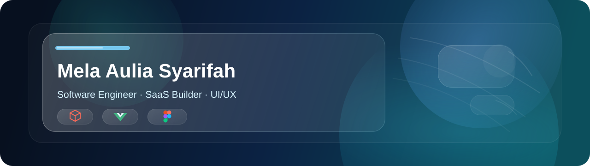

  

<h1 align="center">Hi 👋, I'm Mela Aulia Syarifah</h1>
<h3 align="center">A passionate frontend developer from Indonesia</h3>

- 🌱 I’m currently learning **Laravel, Flutter, Android Studio, Neatbens, Unity, Python & Pengembangan Tampilan Web**

- ⚡ Fun fact **Suka ngoding but tidak ada ide mau buat apa kira kira jika ada ide tolong kasih ide ya (⁠≧⁠▽⁠≦⁠)**

<h3 align="left">Connect with me:</h3>

<h3 align="left">Languages and Tools:</h3>

                

# 🧋 Hi hi~! I'm [Nama Kamu]! ✨

*“Turning coffee into code and ideas into cute interfaces!”* 💖

🎮 **Developer & Design Enthusiast** 
✨ Suka ngoding web, bikin desain cantik, dan ngulik teknologi baru!

 

---

### 🧸 About Me

* 🎓 Lulusan SMK jurusan **Pengembangan Perangkat Lunak dan Game (PPLG)**.
* 💻 Lagi fokus ngembangin skill **Front-End Web Development** & **UI/UX Design**.
* 🎨 Hobi bikin layout desain di **Figma** & **Canva** sebelum dieksekusi jadi kode.
* 🎧 Suka ngoding sambil dengerin musik bernuansa *sad vibes* biar makin fokus~ 🎶
* 🌸 Suka banget bikin web yang punya fitur **Light/Dark Mode**!

---

### 🎀 Tech Stack & Cute Tools

#### 💻 Code & Languages

#### 🚀 Frameworks & Tools

---

### 🍧 Featured Projects

<b>💳 Payment Status Tracking Web App (Click to open! ✨)</b>

 

* Web antarmuka cek status pembayaran ala portal kampus yang estetik.
* Memiliki fitur **Light/Dark Mode Switcher** yang *smooth*.
* **Tech Used:** `HTML` • `CSS` • `JavaScript`
* 🔗 [Lihat Project](https://github.com/USERNAME/project-1)

<b>🌐 Laravel Web Application (Click to open! ✨)</b>

 

* Aplikasi web fullstack untuk sistem informasi dan manajemen data.
* **Tech Used:** `Laravel` • `PHP` • `MySQL`
* 🔗 [Lihat Project](https://github.com/USERNAME/project-2)

<b>🎮 Game Prototype Project (Click to open! ✨)</b>

 

* Prototip game interaktif hasil dari kegiatan proyek industri / PKL.
* **Tech Used:** `C#`
* 🔗 [Lihat Project](https://github.com/USERNAME/project-3)

---

### 🌸 My Little Stats

---

### 💌 Let's Be Friends!

> *"Belajar hal baru setiap hari, satu baris kode demi satu baris kode!"* 🐾

- 💌 **Email:** `emailkamu@gmail.com`
- 💼 **LinkedIn:** [linkedin.com/in/username](https://linkedin.com)
- 🎨 **Portfolio/Design:** [Link Figma atau Canva kamu]

 

  

